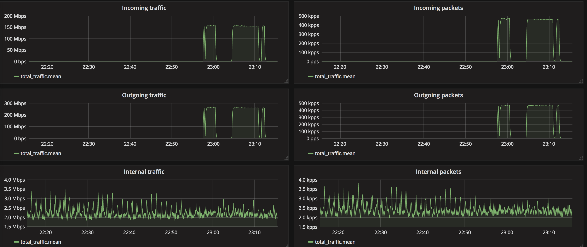

Community Edition
===========
It's a high-performance DDoS detector/sensor built on top of multiple packet capture engines: NetFlow, IPFIX, sFlow, AF_PACKET (port mirror).

What do we do?
--------------
We detect hosts in the deployed network sending or receiving large volumes of traffic, packets/bytes/flows per second and
perform a configurable action to handle that event. These configurable actions include notifying you, calling script or making BGP announcements. 

Project 
-------
🌏️ [Official site](https://github.com/pavel-odintsov/fastnetmon)
🌟️ [Author](https://pavel-odintsov.com/)  
📜️ [Author LinkedIN](https://www.linkedin.com/in/podintsov/)  

Legal
--------------

Author and legal owner: Pavel Odintsov 

### Installation
- [Linux install instructions](https://fastnetmon.com/install/)
- [macOS install instructions](https://formulae.brew.sh/formula/fastnetmon)
- [FreeBSD port](https://www.freshports.org/net-mgmt/fastnetmon/)
- [VyOS bundled support](https://vyos.io/)

Supported packet capture engines
--------------------------------
- NetFlow v5, v9, v9 Lite
- IPFIX
-  v5
- PCAP
- AF_PACKET (recommended)
- AF_XDP (XDP based capture)
- Netmap (deprecated, still supported only for FreeBSD)
- PF_RING / PF_RING ZC (deprecated, available only for CentOS 6 in 1.2.0)

Features
--------
- Detects DoS/DDoS in as little as 1-2 seconds
- Scales up to terabits on single server (sFlow, Netflow, IPFIX) or to 40G + in mirror mode
- Trigger block/notify script if an IP exceeds defined thresholds for packets/bytes/flows per second
- Thresholds can be configured per-subnet basis with the hostgroups feature
- Email notifications about detected attack
- Complete IPv6 support
- Prometheus support: system metrics and total traffic counters
- Flow and packet export to Kafka in JSON and Protobuf format
- Announce blocked IPs via BGP to routers with [ExaBGP](https://github.com/pavel-odintsov/fastnetmon/blob/5b960f76d6bf3dca2c80ef13a3776dfa544fb897/src/fastnetmon.conf#L227) or [GoBGP](https://github.com/pavel-odintsov/fastnetmon/blob/5b960f76d6bf3dca2c80ef13a3776dfa544fb897/src/fastnetmon.conf#L249) (recommended)
- Full integration with [Clickhouse](https://github.com/pavel-odintsov/fastnetmon/blob/7f0ad9c6cd2db3856607aeed04b5e8125fad3124/src/fastnetmon.conf#L287) [InfluxDB](https://github.com/pavel-odintsov/fastnetmon/blob/5b960f76d6bf3dca2c80ef13a3776dfa544fb897/src/fastnetmon.conf#L275) and [Graphite](https://github.com/pavel-odintsov/fastnetmon/blob/5b960f76d6bf3dca2c80ef13a3776dfa544fb897/src/fastnetmon.conf#L314)
- [API](https://github.com/pavel-odintsov/fastnetmon/blob/5b960f76d6bf3dca2c80ef13a3776dfa544fb897/src/fastnetmon.conf#L357)
- [Redis](https://github.com/pavel-odintsov/fastnetmon/blob/5b960f76d6bf3dca2c80ef13a3776dfa544fb897/src/fastnetmon.conf#L211) integration
- MongoDB protocol support compatible with native [MongoDB](https://github.com/pavel-odintsov/fastnetmon/blob/5b960f76d6bf3dca2c80ef13a3776dfa544fb897/src/fastnetmon.conf#L221) and [FerretDB](https://github.com/FerretDB/FerretDB)
- VLAN untagging in mirror and sFlow modes
- Capture attack fingerprints in PCAP format

We track [multiple](https://github.com/pavel-odintsov/fastnetmon/blob/5b960f76d6bf3dca2c80ef13a3776dfa544fb897/src/fastnetmon_logic.cpp#L3033) platform and environment-specific metrics to understand ways how our product is being used and prioritise development accordingly. 

Official support groups:
-------
- [Mailing list](https://groups.google.com/g/fastnetmon)
- [Slack](https://join.slack.com/t/fastnetmon/shared_invite/zt-1i2cutd07-qEafHVoJvAOV5ODlHFsLoQ)
- IRC: #fastnetmon at irc.libera.chat:6697 (TLS) [web client](https://web.libera.chat/?channels=#fastnetmon)
- Telegram: [fastnetmon](https://t.me/fastnetmon)
- Discord: [fastnetmon](https://discord.gg/Q4h9AUqFng)

Follow us at social media:
-------
- [LinkedIn](https://www.linkedin.com/in/podintsov/)

Complete integration with the following vendors
--------------------------------
- [Juniper integration](src/juniper_plugin)
- [A10 Networks Thunder TPS Appliance integration](src/a10_plugin)
- [MikroTik RouterOS](src/mikrotik_plugin)

Screenshots
------------
Command line interface

------------
Standard Grafana dashboard

Example deployment scheme
--------------

CI build status
--------------

Upstream versions in different distributions
--------------

 
