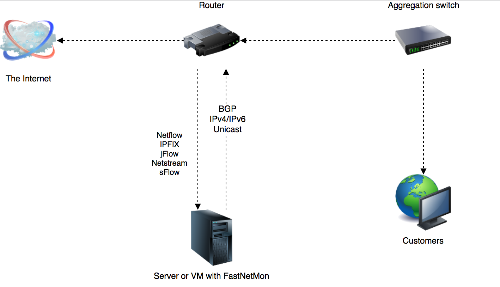

Community Edition
===========
FastNetMon - A high performance DoS/DDoS load analyzer built on top of multiple packet capture engines (NetFlow, IPFIX, sFlow, AF_PACKET, Netmap, PCAP).

What do we do?
--------------
We detect hosts in the deployed network sending or receiving large volumes of traffic, packets/bytes/flows, per second and
perform a configurable action to handle that event. These configurable actions include notifying you, switching off the server, or blackholing the client.

Flow is one or more ICMP, UDP, or TCP packets which can be identified via their unique src IP, dst IP, src port, dst port, and protocol fields.

Project 
-------
- [Official site](https://fastnetmon.com)
- [FastNetMon Advanced, Commercial Edition](https://fastnetmon.com/fastnetmon-advanced/), [order free one month trial](https://fastnetmon.com/trial/)
- [FastNetMon Advanced and Community difference table](https://fastnetmon.com/compare-community-and-advanced/)
- Detailed reference: [link](https://translate.google.com/translate?sl=auto&tl=en&u=https%3A%2F%2Ffastnetmon.com%2Fwp-content%2Fuploads%2F2017%2F07%2FFastNetMon_Reference_Russian.pdf)

Supported packet capture engines
--------------------------------
- NetFlow v5, v9, v9 lite (dev branch)
- IPFIX
-  v5
- PCAP
- AF_PACKET
- Netmap
- PF_RING / PF_RING ZC (available only for CentOS 6 for compatibiliy, otherwise use AF_PACKET)

You can check out the [comparison table](https://fastnetmon.com/docs/capture_backends/) for all available packet capture engines.

Official support groups:
-------
- [Mailing list](https://groups.google.com/forum/#!forum/fastnetmon)
- [Slack](https://join.slack.com/t/fastnetmon/shared_invite/MjM3NDUwNzY4NjA5LTE1MDQ4MzE5NTAtYmU4MjYyYWNiZQ)
- IRC: #fastnetmon at irc.freenode.net [web client](https://webchat.freenode.net/)
- Telegram: [fastnetmon](https://t.me/fastnetmon)

Follow us at social media:
-------
- [Twitter](https://twitter.com/fastnetmon)
- [LinkedIn](https://www.linkedin.com/company/fastnetmon/)
- [Facebook](https://www.facebook.com/fastnetmon/)

Complete integration with the following vendors 
--------------------------------
- [Juniper integration](src/juniper_plugin)
- [A10 Networks Thunder TPS Appliance integration](src/a10_plugin)
- [MikroTik RouterOS](src/mikrotik_plugin)

Features
--------
- Detects DoS/DDoS in as little as 1-2 seconds
- Scales up to terabits on single server (sFlow, Netflow, IPFIX) or to 40G + in mirror mode
- Trigger block/notify script if an IP exceeds defined thresholds for packets/bytes/flows per second
- [Complete support](https://fastnetmon.com/docs/detected_attack_types/) for most popular attack types
- Thresholds can be configured per-subnet basis with the hostgroups feature
- [Email notifications](https://fastnetmon.com/docs/attack_report_example/) about detected attack
- IPv6 support for mirror, Netflow and IPFIX modes
- Announce blocked IPs via BGP to routers with [ExaBGP](https://fastnetmon.com/docs/exabgp_integration/) or  [GoBGP](https://fastnetmon.com/docs/gobgp-integration/) (recommended)
- Full integration with [Graphite](https://fastnetmon.com/docs/graphite_integration/) and [InfluxDB](https://fastnetmon.com/docs/influxdb_integration/)
- [API](https://fastnetmon.com/docs/fastnetmon-community-api/)
- [Redis](https://fastnetmon.com/docs/redis/) integration
- [MongoDB](https://fastnetmon.com/docs/mongodb/) integration
- Netmap support (wire speed processing; only Intel hardware NICs or any hypervisor VM type)
- Supports L2TP decapsulation, VLAN untagging in mirror mode 
- Complete plug-in support
- Capture attack fingerprints in PCAP format
- Experimental [BGP Flow Spec support](https://fastnetmon.com/docs/bgp_flow_spec/), RFC 5575

Running FastNetMon
------------------

### Hardware requirements
- At least 1 GB of RAM

### Installation
- Linux (Debian, CentOS, RHEL, Ubuntu), [install instructions](https://fastnetmon.com/install/)
- [VyOS](https://fastnetmon.com/fastnetmon-community-on-vyos-rolling-1-3/)
- FreeBSD: [official port](https://www.freshports.org/net-mgmt/fastnetmon/).

### Router integration instructions
- [Juniper MX Routers](https://fastnetmon.com/docs/junos_integration/)

Screenshots
------------

Example deployment scheme
--------------

