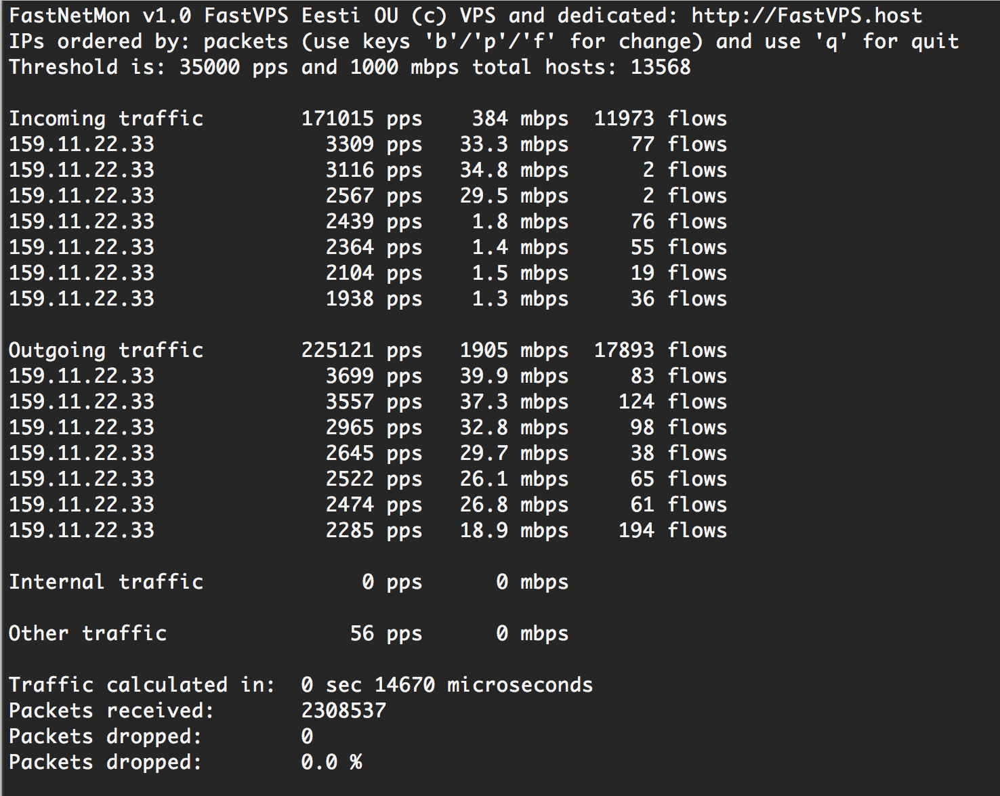

FastNetMon
===========
Author: Pavel Odintsov pavel.odintsov at gmail.com
License: GPLv2

FastNetMon - High Performance Network DDoS and Load Analyzer with PCAP/PF_RING support. But I recommends only PF_RING variant because other variants is so slow and use big amount of CPU and expected big packetloss.

What we do? We can detect hosts in OUR network with big amount of packets per second (30 000 pps in standard configuration) incoming or outgoing from certain host. And we can call external bash script which can send notify, switch off server or blackhole this client.

Why we write it? Because we can't find any software for solving this problem not in proprietary world not in open sourcу. NetFlow based solutions is so slow and can't react on atatck with acceptable speed.

Main programm screen image:



Example for cpu load for Intel i7 2600 with Intel X540 NIC on 250 kpps load:


Features:
- VLAN untagging
- MPLS traffic processing
- Ability to work on mirror ports
- Ability to work on router

At first you should install PF_RING (you can install any latest version):

```bash
cd /usr/src
wget 'http://downloads.sourceforge.net/project/ntop/PF_RING/PF_RING-6.0.1.tar.gz?r=http%3A%2F%2Fsourceforge.net%2Fprojects%2Fntop%2Ffiles%2FPF_RING%2F&ts=1402307916&use_mirror=cznic' -OPF_RING-6.0.1.tar.gz
tar -xf PF_RING-6.0.1.tar.gz 
cd PF_RING-6.0.1
# Debian way
apt-get install build-essential bison flex linux-headers-$(uname -r) libnuma-dev
# CentOS
yum install -y make bison flex kernel-devel gcc gcc-c++
# CentOS openvz case 
yum install -y make bison flex vzkernel-devel gcc gcc-c++
```

Build PF_RING kernel module:
```bash
cd kernel
make 
make install
modprobe pf_ring
```

You can use precompiled and statically linced version of this tool without any compiling:
```bash
mkdir /root/fastnetmon
cd /root/fastnetmon
wget  https://raw.githubusercontent.com/FastVPSEestiOu/fastnetmon/master/fastnetmon -Ofastnetmon
chmod +x fastnetmon
./fastnetmon eth0
```

If you want to use static version you can skip this guide to part about "networks_list".

Build lib (We disabled bpf because it requires linking to PCAP):
```bash
# Debian
apt-get install -y libnuma-dev
# CentOS
yum install -y numactl-devel
cd /usr/src/PF_RING-6.0.1/userland/lib
./configure  --disable-bpf --prefix=/opt/pf_ring
make
make install
```

Install FastNetMon:

```bash
   # Debian 7 Wheezy
   apt-get install -y git  g++ gcc libboost-all-dev make libgpm-dev libncurses5-dev liblog4cpp5-dev libnuma-dev libgeoip-dev libhiredis-dev libpcap-dev
   # CentOS 
   yum install -y git make gcc gcc-c++ boost-devel GeoIP-devel log4cpp-devel ncurses-devel glibc-static ncurses-static gpm-static gpm-devel 

   # For compiling on CentOS please remove line "STATIC = -static" from file Makefile and replace line "LIBS += -lboost_thread" by line "LIBS += -lboost_thread-mt"

   cd /usr/src
   git clone https://github.com/FastVPSEestiOu/fastnetmon.git
   cd fastnetmon
```


Select backend, we use PF_RING as default, if you need PCAP you must change variable ENGINE in Makefile.

Compile it:
```bash
make
```

You should start fastnetmon using this options:
```bash
LD_LIBRARY_PATH=/opt/pf_ring/lib/ ./fastnetmon eth3,eth4
```

If you want to avoid LD_LIBRARY_PATH on every call you should add pf_ring path to system:
```bash
echo "/opt/pf_ring/lib" > /etc/ld.so.conf.d/pf_ring.conf
ldconfig -v
```

Download GeoIP database to current folder:
```bash
http://dev.maxmind.com/geoip/legacy/geolite/
http://download.maxmind.com/download/geoip/database/asnum/GeoIPASNum.dat.gz
gunzip GeoIPASNum.dat.gz
```

It's REQUIRED to add all your networks in CIDR form to file /etc/networks_list if form when one subnet on one line. Please aggregate your networks because long networks list will significatly slow down programm. And please change REDIS_SUPPORT = yes to no in Makefile if you do not need traffic counting feature. When you running this software in OpenVZ node you may did not specify networks explicitly, we can read it from file /proc/vz/veip.

You can add whitelist subnets in similar form to /etc/networks_whitelist (CIDR masks too).

Copy standard config file to /etc:
```bash
cp fastnetmon.conf /etc/fastnetmon.conf
```

Start it:
```bash
./fastnetmon eth1,eth2
```


Example program screen:
```bash
FastNetMon v1.0 all IPs ordered by: packets

Incoming Traffic        96667 pps 240 mbps
xx.xx.xx.xx             7950 pps 3 mbps
xx.xx.xx.xx             5863 pps 65 mbps
xx.xx.xx.xx             2306 pps 1 mbps
xx.xx.xx.xx             1535 pps 16 mbps
xx.xx.xx.xx             1312 pps 14 mbps
xx.xx.xx.xx             1153 pps 0 mbps
xx.xx.xx.xx             1145 pps 0 mbps

Outgoing traffic        133265 pps 952 mbps
xx.xx.xx.xx             7414 pps 4 mbps
xx.xx.xx.xx             5047 pps 4 mbps
xx.xx.xx.xx             3458 pps 3 mbps
xx.xx.xx.xx             2959 pps 35 mbps
xx.xx.xx.xx             2612 pps 29 mbps
xx.xx.xx.xx             2334 pps 26 mbps
xx.xx.xx.xx             1906 pps 21 mbps

Internal traffic        0 pps

Other traffic           1815 pps

Packets received:       6516913578
Packets dropped:        0
Packets dropped:        0.0 %

Ban list:
yy.yy.yy.yy/20613 pps incoming
```

Enable programm start on server startup, please add to /etc/rc.local this lines:
```bash
cd /root/fastnetmon && screen -S fastnetmon -d -m ./fastnetmon eth3,eth4
```

When incoming or outgoing attack arrives programm call bash script (when it exists): /usr/local/bin/notify_about_attack.sh two times. First time when threshold exceed (at this step we know IP, direction and power of attack). Second when we collect 100 packets for detailed audit what did happens.

Example of first notification:
```bash
subject: Myflower Guard: IP xx.xx.xx.xx blocked because incoming attack with power 120613 pps
body: blank
```

Example of second notification:
```bash
subject: Myflower Guard: IP xx.xx.xx.xx blocked because incoming attack with power 120613 pps
body:
IP: xx.zz.xx.1
Attack power: 95267 packets per second
Peak attack power: 269017 packets per second
Attack direction: incoming
Incoming traffic: 43 mbps
Outgoing traffic: 15 mbps
Incoming pps: 95267 packets per second
Outgoing pps: 31119 packets per second

2014-07-04 13:59:54.778872 xx.xx.xx.xx:80 > xx.xx.xx.xx:46804 protocol: tcp size: 233 bytes
2014-07-04 13:59:54.778874 xx.xx.xx.xx:80 > xx.xx.xx.xx:46804 protocol: tcp size: 233 bytes
2014-07-04 13:59:54.778875 xx.xx.xx.xx:80 > xx.xx.xx.xx:46804 protocol: tcp size: 233 bytes
2014-07-04 13:59:54.778877 xx.xx.xx.xx:46804 > xx.xx.xx.xx:80 protocol: tcp size: 52 bytes
2014-07-04 13:59:54.778878 xx.xx.xx.xx:46804 > xx.xx.xx.xx:80 protocol: tcp size: 52 bytes
2014-07-04 13:59:54.778882 xx.xx.xx.xx:80 > xx.xx.xx.xx:46804 protocol: tcp size: 233 bytes
2014-07-04 13:59:54.778884 xx.xx.xx.xx:80 > xx.xx.xx.xx:46804 protocol: tcp size: 233 bytes
2014-07-04 13:59:54.778885 xx.xx.xx.xx:46804 > xx.xx.xx.xx:80 protocol: tcp size: 52 bytes
```


I recommend you to disable CPU freq scaling for gain max performance (max frequency):
```bash
echo performance | tee /sys/devices/system/cpu/cpu*/cpufreq/scaling_governor
```

You can use this script for irq balancing on heavy loaded networks:
```bash
#!/bin/bash

# from http://habrahabr.ru/post/108240/
ncpus=`grep -ciw ^processor /proc/cpuinfo`
test "$ncpus" -gt 1 || exit 1

n=0
for irq in `cat /proc/interrupts | grep eth | awk '{print $1}' | sed s/\://g`
do
    f="/proc/irq/$irq/smp_affinity"
    test -r "$f" || continue
    cpu=$[$ncpus - ($n % $ncpus) - 1]
    if [ $cpu -ge 0 ]
            then
                mask=`printf %x $[2 ** $cpu]`
                echo "Assign SMP affinity: eth queue $n, irq $irq, cpu $cpu, mask 0x$mask"
                echo "$mask" > "$f"
                let n+=1
    fi
done
```

You can find more info and graphics [here](http://forum.nag.ru/forum/index.php?showtopic=89703)

Running tool without root permissions:
```bash
useradd fastnetmon
setcap cap_net_admin+eip fastnetmon
su fastnetmon
./fastnetmon eth0,eth1
```

Please keep in mind when run tool on OpenVZ because without root permissions tool can't get all VE ips and you should pass it explicitly.

Debugging flags.

DUMP_ALL_PACKETS will enable all packets dumping to console. It's very useful for testing tool on non standard platforms.

```bash
DUMP_ALL_PACKETS=yes ./fastnetmon eth3,eth4
```

Recommended configuration options for ixgbe Intel X540 driver:
```bash
cat /etc/modprobe.d/ixgbe.conf 
options ixgbe IntMode=2,2 MQ=1,1 DCA=2,2 RSS=8,8 VMDQ=0,0 max_vfs=0,0 L2LBen=0,0 InterruptThrottleRate=1,1 FCoE=0,0 LRO=1,1 allow_unsupported_sfp=0,0
```

I got very big packet size (more than mtu) in attack log? This issue will be related with offload features of NIC. For INtel 82599 I recommend disable all offload:
```bash
ethtool -K eth0 gro off gso off tso off
```

How I can enable hardware filtration for Intel 82599 NIC? Install patched ixgbe driver from PF_RING distro and apply this patch to Makefile and recompile tool:
```bash
fastnetmon.o: fastnetmon.cpp
-       $(COMPILER) $(STATIC) $(DEFINES) $(HEADERS) -c fastnetmon.cpp -o fastnetmon.o $(BUILD_FLAGS)
+       $(COMPILER) $(STATIC) $(DEFINES) $(HEADERS) -c fastnetmon.cpp -o fastnetmon.o $(BUILD_FLAGS) -DHWFILTER_LOCKING
```

If you saw intel_idle in perf top with red higlihting you can disable it with following kernel params (more details you can find Performance_Tuning_Guide_for_Mellanox_Network_Adapters.pdf):
```bash
intel_idle.max_cstate=0 processor.max_cstate=1
```
