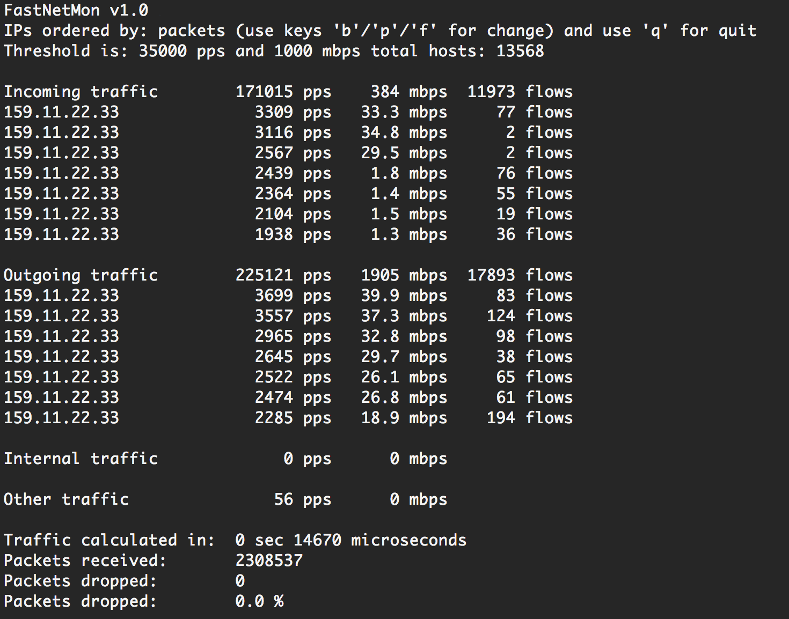

FastNetMon
===========
FastNetMon - A high performance DoS/DDoS load analyzer built on top of multiple packet capture engines (NetFlow, IPFIX, sFLOW, SnabbSwitch, netmap, PF_RING, PCAP).

What can we do? We can detect hosts in our own network with a large amount of packets per second/bytes per second or flow per second incoming or outgoing from certain hosts. And we can call an external script which can notify you, switch off a server or blackhole the client.

To enable sFLOW simply specify IP of server with installed FastNetMon and specify port 6343.
To enable netflow simply specify IP of server with installed FastNetMon and specify port 2055.

Why did we write this? Because we can't find any software for solving this problem in the open source world! 

What is "flow" in FastNetMon terms? It's one or multiple udp, tcp, icmp connections with unique src IP, dst IP, src port, dst port and protocol.

License: GPLv2

  

Project 
-------
- [Mailing list](https://groups.google.com/forum/#!forum/fastnetmon)
- [Roadmap](docs/ROADMAP.md)
- [Release Notes](docs/RELEASENOTES.md)
- Chat: #fastnetmon at irc.freenode.net [web client](https://webchat.freenode.net/)
- [Please fill survey, we need your voice!](https://docs.google.com/forms/d/1YoXQImMeEjBH-JPz3KYtcDwknHs8xrI538ObwSy9uZo/viewform)
- Detailed reference in Russian: [link](docs/FastNetMon_Reference_Russian.pdf)

Supported packet capture engines
--------------------------------
- NetFlow v5, v9
- IPFIX
-  v4 (dev branch only), v5
- Port mirror/SPAN capture with PF_RING (with ZC/DNA mode support [need license](http://www.ntop.org/products/pf_ring/)), SnabbSwitch, NETMAP and PCAP

You could look [comparison table](docs/CAPTURE_BACKENDS.md) for all available packet capture engines.

Features
--------
- Complete [BGP Flow Spec support](docs/BGP_FLOW_SPEC.md), RFC 5575
- Can process incoming and outgoing traffic
- Can trigger block script if certain IP loads network with a large amount of packets/bytes/flows per second
- Thresholds could be configured in per subnet basis with hostgroups feature
- Could [announce blocked IPs](docs/EXABGP_INTEGRATION.md) to BGP router with [ExaBGP](https://github.com/Exa-Networks/exabgp)
- GoBGP [integration](docs/GOBGP.md) for unicast IPv4 announces
- Full integration with [Graphite](docs/GRAPHITE_INTEGRATION.md) and [InfluxDB](docs/INFLUXDB_INTEGRATION.md)
- API
- Redis integration
- MongoDB integration
- Deep packet inspection for attack traffic
- netmap support (open source; wire speed processing; only Intel hardware NICs or any hypervisor VM type)
- SnabbSwitch support (open source, very flexible, LUA driven, very-very-very fast)
- Could filter out NetFLOW v5 flows or sFLOW packets with script implemented in LUA (useful for port exclude)
- Supports L2TP decapsulation, VLAN untagging and MPLS processing in mirror mode 
- Can work on server/soft-router
- Can detect DoS/DDoS in 1-2 seconds
- [Tested](docs/PERFORMANCE_TESTS.md) up to 10GE with 12 Mpps on Intel i7 3820 with Intel NIC 82599
- Complete plugin support
- Could capture attack fingerprint in pcap format
- Have [complete support](docs/DETECTED_ATTACK_TYPES.md) for most popular attack types

Running Fastnetmon
------------------
### Supported platforms
- Linux (Debian 6/7/8, CentOS 6/7, Ubuntu 12+)
- FreeBSD 9, 10, 11
- Mac OS X Yosemite

### Supported architectures
- x86 64 bit (recommended)
- x86 32 bit

### Router integration instructions
- [Juniper MX Routers](docs/JUNOS_INTEGRATION.md)

### Distributions supported
- We are part of [CloudRouter](https://cloudrouter.org/cloudrouter/2015/07/09/fastnetmon.html) distribution
- We are part of [official FreeBSD ports](https://freshports.org/net-mgmt/fastnetmon/), [manual install](docs/FreeBSD_INSTALL.md)
- [Amazon AMI image](docs/AMAZON.md)
- [VyOS based iso image with bundled FastNetMon](docs/VYOS_BINARY_ISO_IMAGE.md)
- [Docker image](docs/DOCKER_INSTALL.md)
- [Binary rpm packages for CentOS 6/7 and Fedora 21](docs/INSTALL_RPM_PACKAGES.md)
- [Automatic install script for Debian/Ubuntu/CentOS/Fedora/Gentoo](docs/INSTALL.md)
- [Automatic install script for Mac OS X](docs/MAC_OS_INSTALL.md)
- [Manual install on Slackware](docs/SLACKWARE_INSTALL.md)
- [Manual install for VyOS](docs/VyOS_INSTALL.md)

Screenshoots
------------

Main program screen image:

Example for cpu load on Intel i7 2600 with Intel X540/82599 NIC on 400 kpps load:

Example deployment scheme:

Example of [notification email](docs/ATTACK_REPORT_EXAMPLE.md) about detected attack.

How I can help project?
-----------------------
- We are looking for maintainer for Debian and Fedora/EPEL packages
- Test it! 
- Share your experience
- Share your use cases
- Share your improvements
- Test it with different equipment
- Create feature requests

Author: [Pavel Odintsov](http://ru.linkedin.com/in/podintsov/) pavel.odintsov at gmail.com [Follow my Twitter](https://twitter.com/odintsov_pavel)
