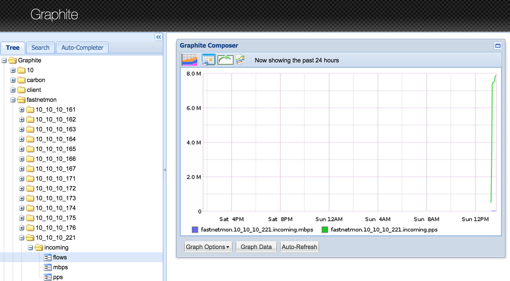

### Graphite integration

Example screen: 

We could store pps/bps/flow number for top 7 (could be configured) host in incoming and outgoung directions. In addition to this we export total pps/bps/flow number which flow over FastNetMon.

Configuration from FastNetMon side is very simple, please put following fields to /etc/fastnetmon.conf:
```bash
graphite = on
graphite_host = 127.0.0.1
graphite_port = 2003
graphite_prefix = fastnetmon
```

### Install Graphite Debian 8 Jessie 

First of all, please install all packages:
```bash
apt-get install -y python-whisper graphite-carbon
```

Whisper - it's database for data. Graphite - service for storing and retrieving data from database. 

Install web frontend:
```bash
apt-get install -y graphite-web
```

Create database, specify login/password and email here: 
```bash
graphite-manage syncdb
```

Specify your timezone in file /etc/graphite/local_settings.py on line TIME_ZONE.

Change owner:
```bash
chown _graphite:_graphite /var/lib/graphite/graphite.db
```

Run it with apache:
```bash
apt-get install -y libapache2-mod-wsgi apache2-mpm-prefork
cp /usr/share/graphite-web/apache2-graphite.conf  /etc/apache2/sites-available/graphite-web.conf
a2dissite 000-default.conf
a2ensite graphite-web
a2enmod wsgi
```

Enable load on startup:
```bash
systemctl enable apache2.service
systemctl restart apache2.service
```

Open site: 
http://ip.ad.dr.es

Put test data to Graphite:
```echo "test.bash.stats 42 `date +%s`" | nc -q0 127.0.0.1 2003```

If you have issues with Carbon like this:
```bash
/etc/init.d/carbon-cache start
 * Starting Graphite backend daemon carbon-cache                                                                                                       Traceback (most recent call last):
  File "/usr/bin/carbon-cache", line 32, in <module>
    run_twistd_plugin(__file__)
  File "/usr/lib/python2.7/dist-packages/carbon/util.py", line 90, in run_twistd_plugin
    config.parseOptions(twistd_options)
  File "/usr/local/lib/python2.7/dist-packages/twisted/application/app.py", line 619, in parseOptions
    usage.Options.parseOptions(self, options)
  File "/usr/local/lib/python2.7/dist-packages/twisted/python/usage.py", line 270, in parseOptions
    raise UsageError("Unknown command: %s" % sub)
twisted.python.usage.UsageError: Unknown command: carbon-cache
```

Please check this [link](http://stackoverflow.com/questions/27951317/install-graphite-statsd-getting-error-unknown-carbon-cache)

Some useful graphics for Graphite.

Total load:
```bash
fastnetmon.incoming.pps
fastnetmon.outgoing.pps

fastnetmon.incoming.mbps
fastnetmon.outgoing.mbps
```

Top talkers:
```bash
highestMax(fastnetmon.*.outgoing.average.pps, 10)
highestMax(fastnetmon.*.outgoing.average.mbps, 10)
highestMax(fastnetmon.*.incoming.average.pps, 10)
highestMax(fastnetmon.*.incoming.average.mbps, 10)
```

Also I recommend to configure Graphite this way.

For big networks please enlarge number of created file in /etc/carbon/carbon.conf:
```bash
MAX_CREATES_PER_MINUTE = 5000
```

And if you want to store data every 5 seconds for 1 months please do following _before_ starting collection to Graphite in file /etc/carbon/storage-schemas.conf:
```bash
[default_5sec_for_1month]
pattern = .*
retentions = 5s:31d
``` 
